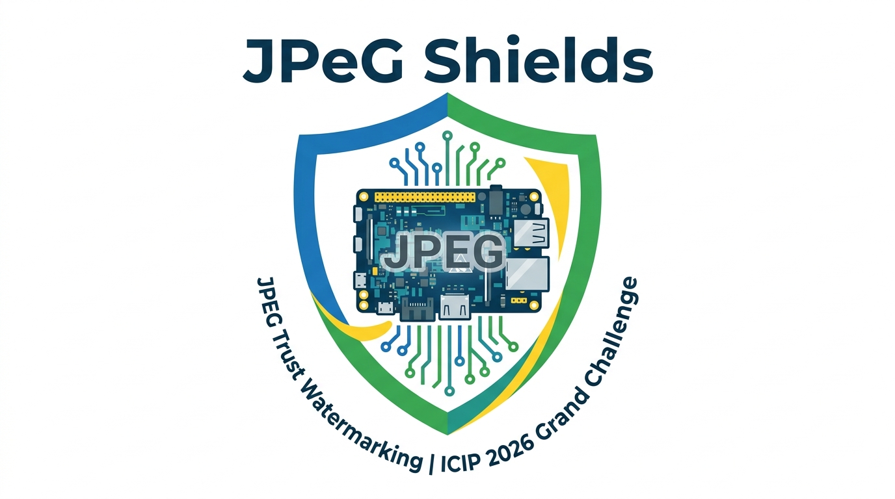

# JPEGShields

> Frequency-domain image watermarking for the **JPEG Trust Watermarking Grand Challenge @ ICIP 2026**



JPEGShields embeds imperceptible 100-bit binary watermarks into images using the **Discrete Fourier Transform (DFT)**. It is evaluated on two axes: *imperceptibility* (how invisible the watermark is) and *robustness* (how well the watermark survives 18 different image attacks). The system is written in Python and is designed to run end-to-end in Google Colab.

---

## Table of Contents

- [How It Works](#how-it-works)
- [Repository Structure](#repository-structure)
- [Installation](#installation)
- [Usage](#usage)
- [Evaluation Metrics](#evaluation-metrics)
- [Results](#results)
- [Competition](#competition)

---

## How It Works

### Embedding (`WaterMarker.generate`)

The watermark is encoded into each RGB channel independently:

1. A 2D FFT with frequency shift (`fftshift`) transforms the image into the frequency domain.
2. The magnitude and phase components are separated.
3. Each of the 100 watermark bits is encoded at a specific diagonal position in the magnitude spectrum — set to `mean_magnitude × tolerance_factor` for a `1` bit, or `0` for a `0` bit.
4. The image is reconstructed via inverse FFT and pixel values are clipped to `[0, 255]`.

### Recovery (`WaterMarker.recover`)

1. The (possibly attacked) image is transformed back into the frequency domain.
2. The same diagonal positions used during embedding are sampled.
3. Each sampled value is compared to the mean magnitude to recover a binary bit.
4. Recovered bit sequences from all three channels are averaged and passed through a majority vote.

---

## Repository Structure

```
JPEGShields/
├── WaterMarker.py                  # Core watermarking class
├── jpegshield_pipeline.ipynb       # End-to-end evaluation pipeline (Google Colab)
├── ColabNotebook.ipynb             # Supplementary Colab notebook
├── demo.ipynb                      # Quick-start demo notebook
├── test.py                         # Standalone test script
├── requirements.txt                # Python dependencies
├── watermarking_result.xlsx        # Aggregated benchmark results
├── logo.png                        # Project logo
└── README.md
```

---

## Installation

```bash
pip install opencv-python scikit-image scipy pandas tqdm matplotlib pillow-jxl ultralytics
pip install "git+https://github.com/JPEG-Trust-Community/watermarking.git#subdirectory=evaluation_metric/package"
```

For the AI-based attacks (`create_ai`, `replace_ai`, `remove_ai`), an **OpenAI API key** is required. Store it as a Colab secret under the name `OPENAI_API_KEY`.

---

## Usage

### Google Colab (Full Pipeline)

Clone the repo and open `jpegshield_pipeline.ipynb` in Google Colab. Set the following paths near the top of the notebook:

```python
DATASET_ROOT     = "/content/drive/MyDrive/JPEGShields-main/Watermark Evaluation Dataset-Public"
WATERMARKER_PATH = "/content/JPEGShields/WaterMarker.py"
OUTPUT_ROOT      = "/content/drive/MyDrive/JPEGShields-main/outputs"
```

The pipeline will:

1. Mount Google Drive and scan `Camera_Capture` and `Synthetic` image subfolders.
2. Embed a reproducible 100-bit watermark (random seed `42`) into each image.
3. Apply all 18 attack types to each watermarked image.
4. Record imperceptibility and robustness metrics for each image/attack pair.
5. Save results and attacked images back to Google Drive.
6. Generate seaborn bar plots of mean metrics per attack type.

**Output directories:**

| Path | Contents |
|---|---|
| `outputs/watermarked/` | Watermarked images |
| `outputs/processed/` | Attacked images |
| `outputs/watermarks/` | Ground truth and recovered bit strings |
| `jpegshield_pipeline_results.csv` | Full per-image results |

### Standalone Python

```python
import numpy as np
import cv2
from WaterMarker import WaterMarker

marker = WaterMarker()

# Load image
img = cv2.cvtColor(cv2.imread("image.png"), cv2.COLOR_BGR2RGB)

# Generate a reproducible 100-bit watermark
rng = np.random.default_rng(42)
watermark = rng.integers(0, 2, size=100, dtype=np.uint8)

# Embed
watermarked = marker.generate(img, watermark)

# Recover
recovered = marker.recover(watermarked)

# Evaluate
metrics = marker.evaluate_watermarking(img, watermarked)
ber     = float(np.mean(watermark != recovered))

print(metrics)
print("BER:", ber)
```

---

## API Reference — `WaterMarker`

| Method | Description |
|---|---|
| `generate(image, watermark)` | Embeds a 100-bit binary watermark via DFT magnitude modification |
| `recover(image)` | Extracts the watermark from a (possibly attacked) image |
| `evaluate(image, original_watermark)` | Returns the number of incorrectly recovered bits |
| `evaluate_watermarking(orig, watermarked)` | Returns a dict of all imperceptibility metrics |
| `compute_psnr(orig, watermarked)` | Peak Signal-to-Noise Ratio |
| `compute_wpsnr(orig, watermarked)` | Weighted PSNR (luminance-based perceptual weighting) |
| `compute_ssim(orig, watermarked)` | Structural Similarity Index |
| `compute_jnd(orig, watermarked)` | Just Noticeable Difference (mean absolute luminance difference) |

**Key parameters:**

| Parameter | Value | Description |
|---|---|---|
| `seq_len` | `100` | Watermark length in bits |
| `tolerance_factor` | `20` | Multiplier on mean magnitude for embedding strength |
| `threshold` | `0.5` | Recovery threshold divisor against mean magnitude |

---

## Evaluation Metrics

| Metric | Description | Goal |
|---|---|---|
| **PSNR** | Standard pixel-level distortion measure (dB) | ↑ Higher is better |
| **wPSNR** | Perceptually weighted PSNR, luminance-sensitive (dB) | ↑ Higher is better |
| **SSIM** | Structural similarity of luminance, contrast, and structure | ↑ Higher is better |
| **JND** | Mean absolute luminance difference — perceptual visibility | ↓ Lower is better |
| **BER** | Bit Error Rate — fraction of incorrectly recovered bits | ↓ Lower is better |

A BER of `0.5` indicates complete watermark loss (equivalent to random chance).

---

## Results

Evaluation was run on the JPEG Trust public benchmark dataset across `Camera_Capture` and `Synthetic` image subsets. Each image was watermarked with a fixed 100-bit sequence (seed `42`) and subjected to each of the 18 attacks independently.

### Imperceptibility

The watermark is perceptually invisible across all evaluated images:

| Metric | Mean | Std |
|---|---|---|
| PSNR (dB) | 47.46 | ±2.98 |
| wPSNR (dB) | 49.26 | ±3.29 |
| SSIM | 0.9919 | ±0.0060 |
| JND | 0.7354 | ±0.3178 |

### Robustness — BER per Attack

| Attack | BER Mean| Notes |
|---|---|---|---|
| `gaussian_noise` | 0.0150| Best robustness — noise preserves DFT structure |
| `speckle_noise` | 0.0258| Very robust against multiplicative noise |
| `brightness` | 0.0973   | Robust — linear scaling preserves magnitude ratios |
| `sharpness` | 0.1450    | Mostly robust |
| `jpeg2000` | 0.4116     | Partial degradation |
| `median_filtering`      | 0.5034 | Near-total watermark loss |
| `blurring` | 0.5244     | Near-total watermark loss |
| `jpeg` | 0.5244         | Near-total watermark loss |
| `crop` | 0.5319         | Near-total watermark loss |
| `flipping` | 0.5200     | Complete watermark loss |
| `rotate` | 0.5300       | Complete loss — geometric transforms break diagonal positions |
| `scaled` | 0.5300       | Complete watermark loss |
| `create_ai` | N/A       | Not evaluated (pipeline error) |
| `replace_ai` | N/A      | Not evaluated (pipeline error) |
| `remove_ai` | N/A       | Not evaluated (pipeline error) |
| `jpegai` | N/A          | Not evaluated (pipeline error) |
| `jpegxl` | N/A          | Not evaluated (pipeline error) |

### Analysis

JPEGShields achieves strong imperceptibility (PSNR ~47.5 dB, SSIM ~0.992) and is highly robust against additive noise (`gaussian_noise`, `speckle_noise`) and global tonal changes (`brightness`, `sharpness`). However, geometric transforms (`rotate`, `scale`, `flip`, `crop`) and spatial filtering operations (`blur`, `median`, `jpeg`) cause near-complete watermark loss, as they displace or destroy the specific diagonal frequency components used for encoding. These are well-known limitations of fixed-position frequency-domain watermarking and are the primary targets for future improvement.

---

## Competition

This system is a submission to the **[JPEG Trust Watermarking Grand Challenge](https://jpeg.org/jpegai/watermarking)** at **ICIP 2026**, which evaluates watermarking methods on imperceptibility (PSNR, wPSNR, SSIM, JND, FID) and robustness (BER) across a standardised benchmark dataset.

---

## License

This project is open source. See the repository for details.
